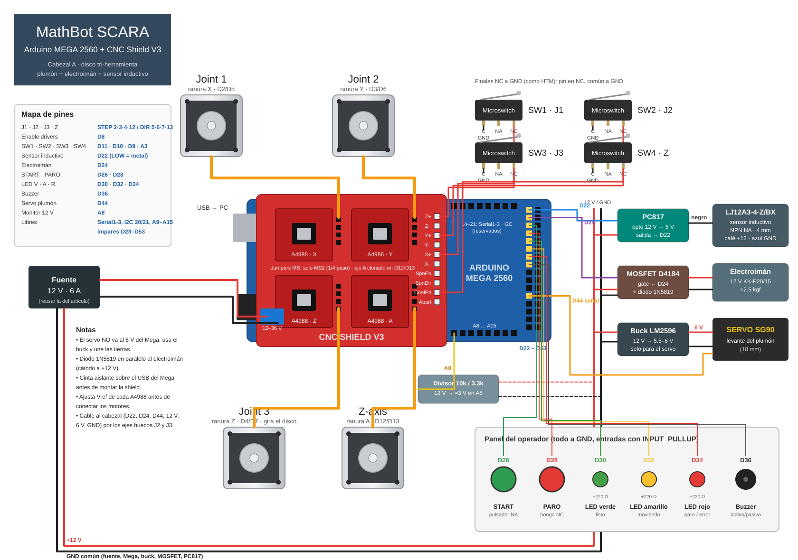

# Firmware MathBot · Arduino MEGA 2560

La CNC Shield V3 se monta sobre el Mega igual que sobre el UNO: los pines D2–D13 y A0–A3 coinciden,
así que motores y finales de carrera quedan como en el artículo de HowToMechatronics. Lo que agrega
el cabezal de disco va a los pines que solo tiene el Mega.

| Función | Pin | Notas |
|---|---|---|
| J1 · J2 · J3 · Z (STEP / DIR) | 2/5 · 3/6 · 4/7 · 12/13 | ranuras X, Y, Z, A (eje A clonado en D12/D13) |
| Enable de los 4 drivers | D8 | LOW = energizados |
| Finales SW1 J1 · SW2 J2 · SW3 J3 · SW4 Z | D11 · D10 · D9 · A3 | NC a GND, como HTM |
| Sensor inductivo (vía PC817) | D22 | LOW = metal |
| Electroimán (módulo MOSFET D4184) | D24 | diodo 1N5819 en paralelo a la bobina |
| START · PARO | D26 · D28 | NA a GND · hongo NC a GND |
| LED verde · amarillo · rojo | D30 · D32 · D34 | con 220 Ω |
| Buzzer | D36 | |
| Servo SG90 del plumón | D44 | alimentado por el buck a 5.5–6 V, no por el Mega |
| Monitor de 12 V | A8 | divisor 10 kΩ / 3.3 kΩ |
| Libres | Serial1–3, I2C 20/21, A9–A15, impares D23–D53 | HC-05, STS3215, AS5600, LCD |

Microstepping: jumper **solo en MS2** de cada driver (1/4 de paso, el que usa `python/scara_modelo.py`).

## Sketches

| Carpeta | Para qué |
|---|---|
| `mathbot_mega/` | Firmware completo: homing, IK por herramienta, cambio de herramienta con J3, misión (escaneo → recolección → rosa), paro de emergencia y comandos por Serial |
| `prueba_componentes/` | Menú para probar cada motor, final de carrera, sensor, electroimán, botones, LED, buzzer y los 12 V por separado |
| `prueba_servo/` | Calibra las posiciones ARRIBA/ABAJO del plumón; copia los valores a `SERVO_ARRIBA` / `SERVO_ABAJO` |

Necesitan la biblioteca **AccelStepper** (Gestor de bibliotecas). Placa: *Arduino Mega or Mega 2560*.
Monitor Serie a 115200 con fin de línea "Nueva línea".

Orden recomendado: `prueba_servo` → `prueba_componentes` (ajusta `INVERTIR_DIR` si un eje gira al revés)
→ `mathbot_mega` con `H` y luego `R`. Antes de la primera misión calibra `HOME_POS` (están los valores
de HTM) y las alturas Z.

## Simular en Wokwi

1. Abre <https://wokwi.com/projects/new/arduino-mega>.
2. Pestaña `diagram.json`: reemplaza todo por `wokwi/diagram.json`.
3. Library Manager → agrega **AccelStepper** (o crea `libraries.txt` con el de `wokwi/`).
4. Pestaña `sketch.ino`: pega el sketch que quieras probar y cambia `SIMULACION = true`
   (en Wokwi los finales de carrera son pulsadores NA).
5. Play. Comandos útiles en `mathbot_mega`: `S` (salta el homing), `?`, `T s`, `M 200 -100`, `D`, `R`.
   Para probar el homing con `H`, pulsa SW4, SW3, SW2 y SW1 en ese orden mientras cada motor gira.

En la simulación el electroimán es el LED morado, el sensor es el pulsador azul "Sensor: metal"
(mantenlo apretado durante el escaneo para marcar una pieza como metálica), el PARO es el interruptor
deslizante y el potenciómetro hace de divisor de 12 V. El servo se alimenta del 5 V solo en Wokwi.
